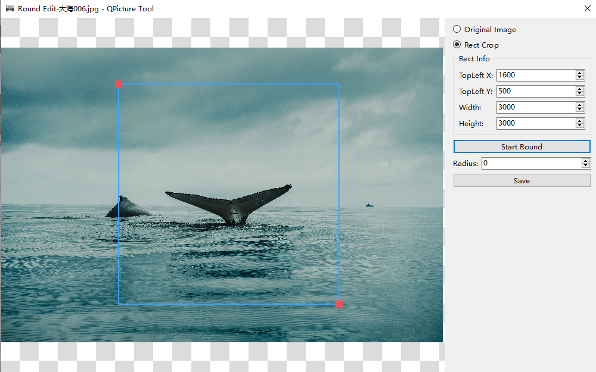
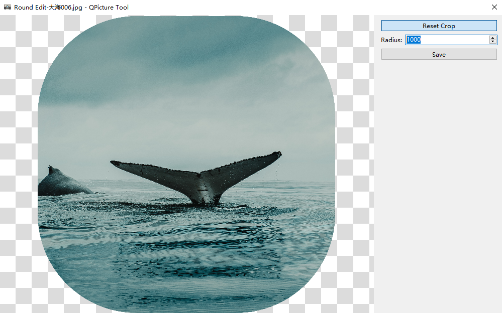
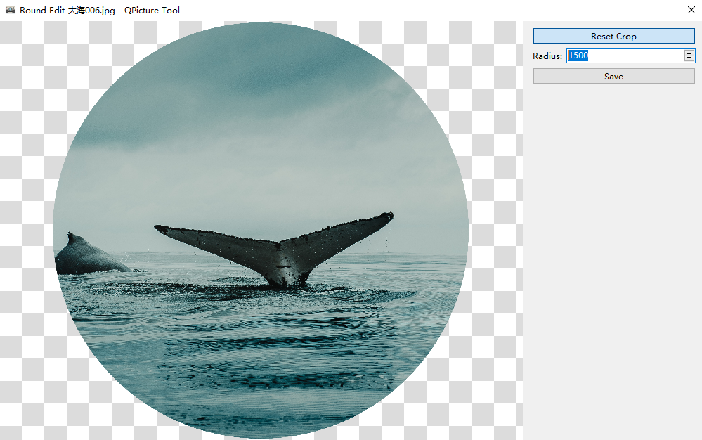
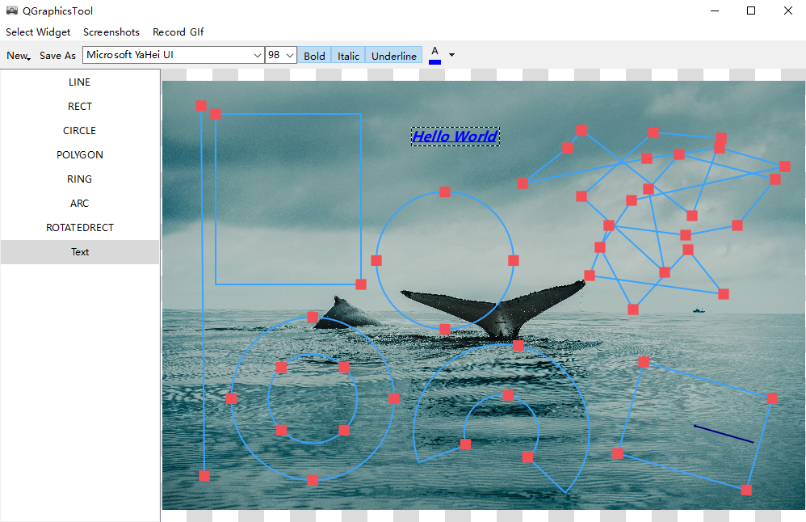
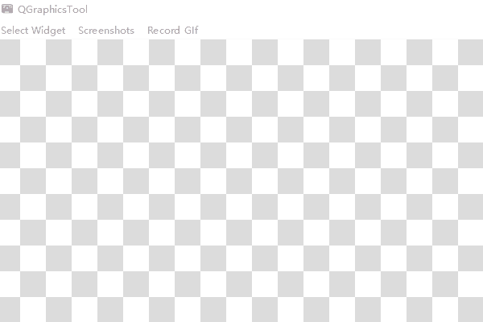

# Qt Graphics

-   [Simplified Chinese](README.md)
-   [English](README.en.md)

## Effect picture update will not be timely

## 1. Viewing interface:

## 2. Opengl view interface:

1.  The performance is much better than that of using the QGraphicsView interface, which is very smooth and takes up very little CPU resources;

### 问题

1.  Opengl viewing interface, when rotating at any angle, the aspect ratio of the texture will change, resulting in abnormal display, this problem has not been resolved;

## 3. Mosaic drawing interface (eraser effect):

## 4. Round corner editing window (can also be edited into a round icon):

1.  Be sure to save it as PNG, otherwise the rounded corners will turn black;

 

 

## 5. Simple graphic drawing interface:

## 6. Movie subtitle splicing interface:

1.  The picture on the left is a picture that is quickly zoomed after loading, and the display is not clear, mainly to save memory;
2.  The picture on the right is the original picture displayed. Since the scaling of QImageView is not clear, you can adjust it to the size of the original picture (double-click on the left side), and it looks very comfortable;
3.  Although it looks blurry at first glance, it is actually generated by reloading the original image on the left and cutting it. After saving, it can be verified by other image viewing tools, or viewed according to the previous point (2);

## 7. GIF recording (egif and gif-h library) and screenshot function:

1.  以下为用GIF录制功能，录制截图功能使用；
2.  After taking a screenshot, you can use (4) to draw graphics;
    

       
