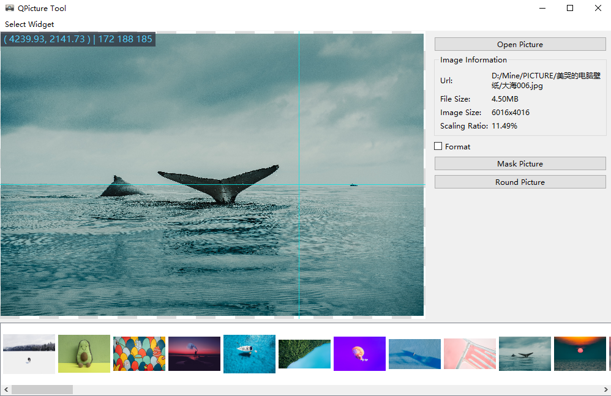
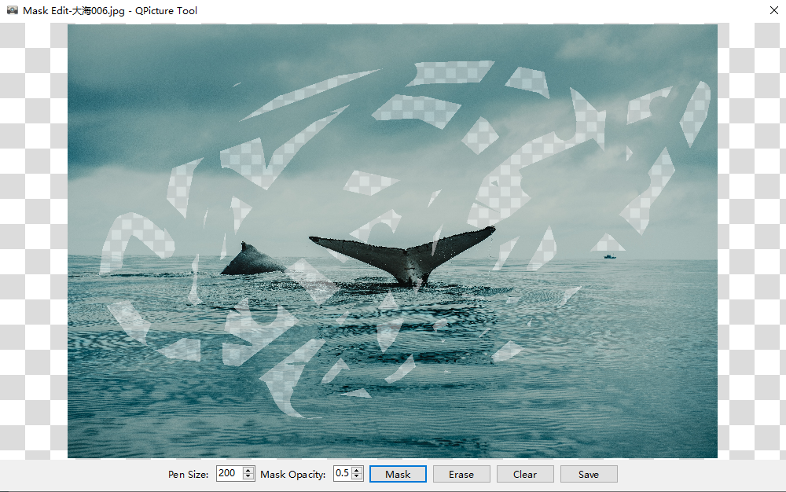
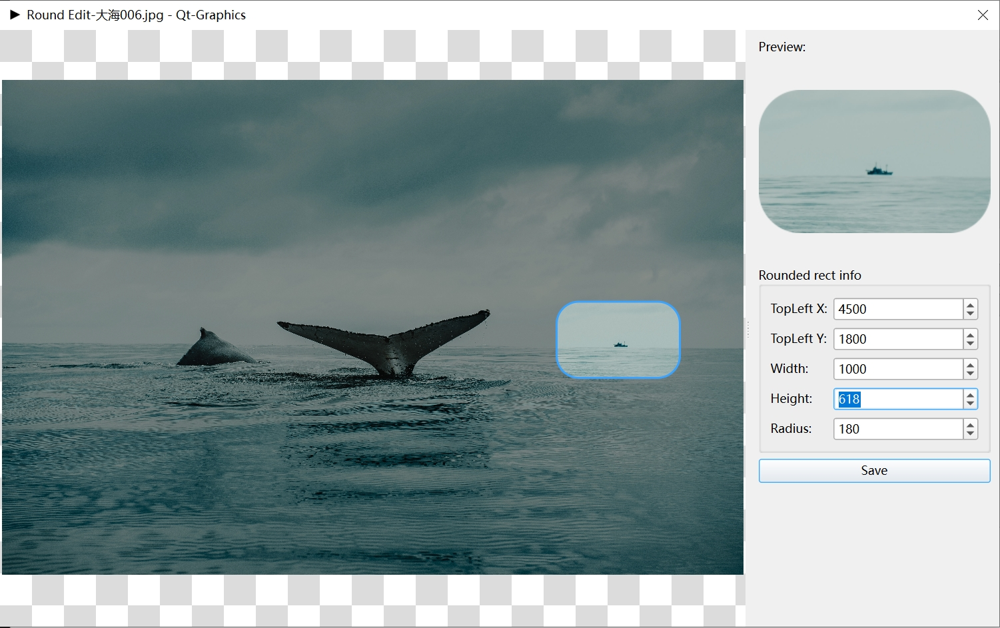
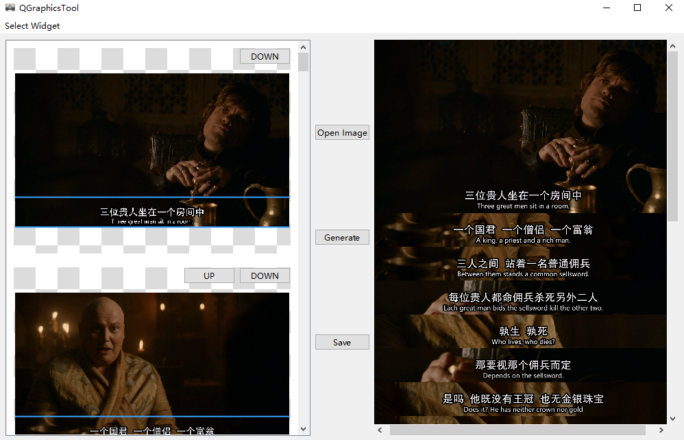
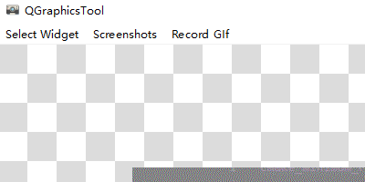

# Qt Graphics

-   [Simplified Chinese](README.md)
-   [English](README.en.md)

## The renderings will not be updated in a timely manner

## QRhiWidget

### question

#### rotate

1.  Similar to the OpenGL image viewing interface, when rotating at any angle, the aspect ratio of the texture will change, resulting in abnormal display;

## QVulkanWindow

### question

#### compile

1.  [cmake](.github/workflows/cmake.yml): The header files related to QVulkanWindow cannot be found under MacOS, and the compilation cannot pass;
2.  [qmake](.github/workflows/qmake.yml)：
    1.  Under MacOS, the header files related to QVulkanWindowRenderer will not be found, and the compilation will not pass;
    2.  Under Ubuntu, the header files related to QVulkanInstance will not be found, and the compilation will not pass:

#### rotate

1.  Similar to the OpenGL image viewing interface, when rotating at any angle, the aspect ratio of the texture will change, resulting in abnormal display;

#### Image loading speed issue

1.  use`QPixmapCache`or`QCache`Caching technologies such as this can use space for time to improve loading speed when loading already loaded images.

## Picture viewing interface

## Opengl picture viewing interface

1.  The performance is much better than the picture viewing interface using QGraphicsView, it is very smooth and takes up very little CPU resources;

### question

1.  In the Opengl image viewing interface, when rotating at any angle, the aspect ratio of the texture will change, causing abnormal display. This problem has not yet been solved;

## Mosaic drawing interface (eraser effect)

## Rounded editing window (can also be edited into a round icon)

1.  Be sure to save it as PNG, otherwise the rounded corners will turn black;

## Simple graphics drawing interface

## Movie subtitle splicing interface

1.  The picture on the left is a picture that is quickly zoomed after loading. The display is not clear, mainly to save memory;
2.  The picture on the right is the original picture displayed. Since the QImageView zoom is not clear, you can adjust it to the size of the original picture for viewing (double-click on the left side), which looks very comfortable;
3.  Although it looks blurry at first glance, it is actually generated by reloading the original image on the left and cutting it. After saving, you can verify it with other image viewing tools, or view it according to the previous point (2);

## GIF recording (egif and gif-h libraries) and screenshot functionality

1.  The following is the use of GIF recording function and screenshot recording function;
2.  After taking a screenshot, you can use (4) to draw graphics;

