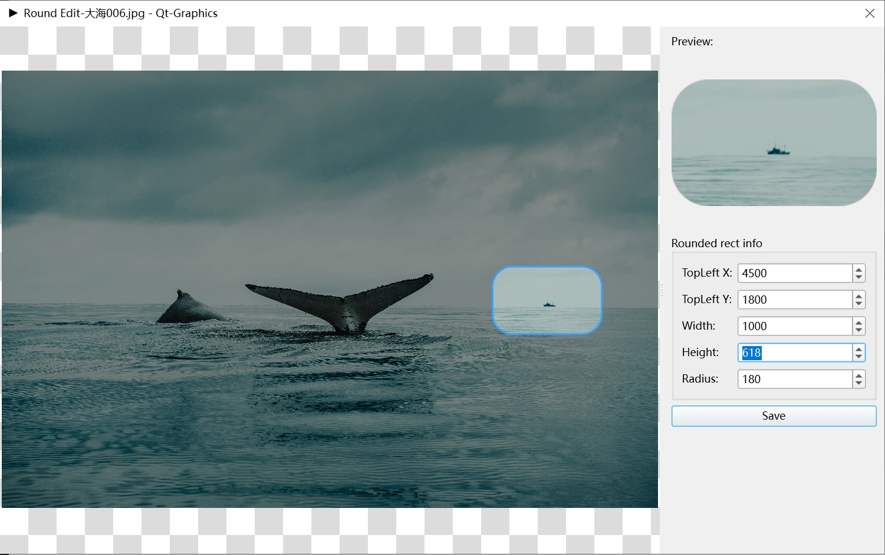

# Qt Graphics

-   [Simplified Chinese](README.md)
-   [English](README.en.md)

> **Notice**: The renderings may not be updated in time.

## 支持更多图片格式

For more image formats, please refer to[kimageformats-binaries](https://github.com/RealChuan/kimageformats-binaries/tree/dev)：

1.  from`Actions`Download in`Artifacts`folder,`kimg_*`Unzip the library file to the Qt packaged directory`imageformats`in folder;
2.  Other dependent library files need to be placed in the directory at the same level of the main program or where the main program can load.

* * *

## Pros and cons of rendering 2D textures with GPU (QRhiWidget, QVulkanWindow, QOpenGLWidget)

### advantage

-   **Excellent performance**: Compared with the image viewing interface based on QGraphicsView, GPU rendering is smoother and the CPU occupies extremely low.

### shortcoming

-   **Rotate display problem**: When rotating at any angle, the texture aspect ratio may change, resulting in abnormal display.
    -   [openglview](src/gpugraphics/openglview.cc)A temporary solution is provided in this article to maintain the aspect ratio of the original image when rotated, but the original zoom ratio needs to be discarded and adjusted to adapt to the window or original image size.
    -   Please refer to the specific implementation`rotatedTextureSize`、`rotateNinetieth`and`anti_rotateNinetieth`function.

* * *

## QVulkanWindow Compilation Instructions

### Known compilation issues

1.  **CMake（MacOS）**: The QVulkanWindow related header file cannot be found, and the compilation failed.
2.  **qmake**：
    -   **MacOS**: The QVulkanWindowRenderer header file is missing, and the compilation failed.
    -   **Ubuntu**: The QVulkanInstance header file is missing, and the compilation failed.
3.  Compilation of the above environment has been temporarily disabled.

* * *

## Multi-image file viewer

-   Support from single files (e.g.`ico`、`gif`Read multiple images in, etc.) and display them.
-   Other formats need to be dependent`kimageformats-binaries` 插件支持。

* * *

## ICO file production

### Known issues

-   **[FreeImage](https://github.com/danoli3/FreeImage)**Generate inclusion`256x256`The image has a flaw in its ICO file: it will incorrectly set the width and height field directly to`256`, not the format specification required`0`or`255`, causing Windows Explorer to fail to correctly recognize the resolution.
-   **Solution**：
    -   Used based[QtIcoHandler](https://github.com/qt/qtbase/blob/dev/src/plugins/imageformats/ico/qicohandler.h)Modified[icowriter](/src/utils/icowriter.hpp)。
-   **Recommended resolution**：`256x256`、`128x128`、`64x64`、`48x48`、`32x32`、`16x16`。

* * *

## Functional interface example

### 1. Image viewing interface

* * *

### 2. Mosaic drawing (eraser effect)

* * *

### 3. Rounded corners/circular icon editing

> **Notice**: Please save it in PNG format, otherwise the rounded area may appear in black.
>
> 

> 
> 

* * *

### 4. Simple graphic drawing

* * *

### 5. Movie subtitles

-   The left side is a quick zoom preview (may be blurry), and the right side is the original image.
-   When actually generated, it is cropped based on the original image, and the clarity can be verified after saving.

* * *

### 6. GIF recording (egif/gif-h library) and screenshot functions

-   The following image uses the GIF recording function to demonstrate the screenshot process:
-   After taking a screenshot, you can use the graphics drawing function in (4) to edit it.

