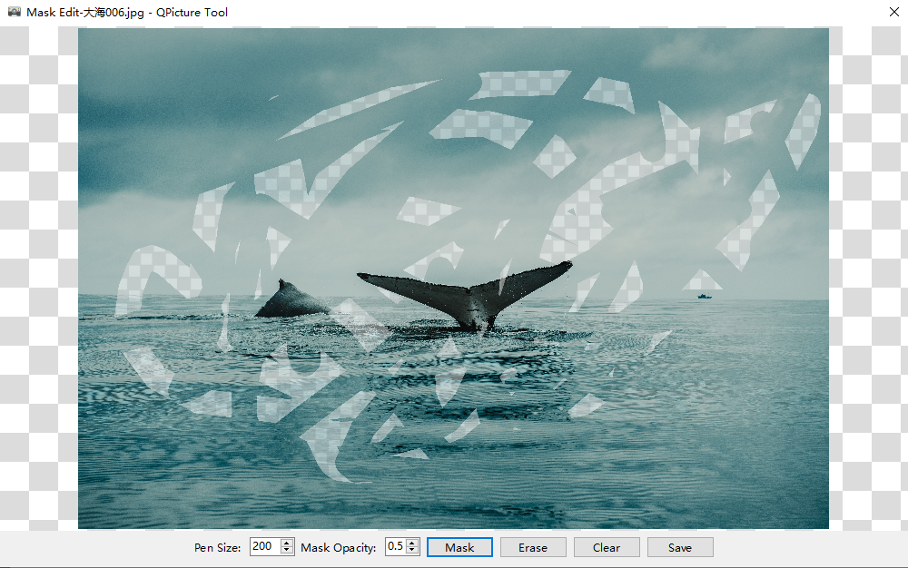
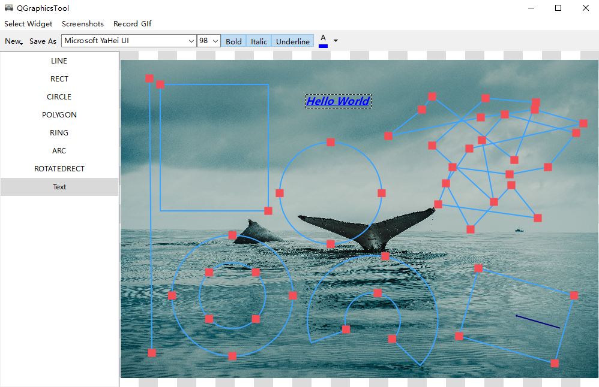

# Qt Graphics

-   [Simplified Chinese](README.md)
-   [English](README.en.md)

## The renderings will be updated in time

## Support more image formats, please refer to[kimageformats-binaries](https://github.com/RealChuan/kimageformats-binaries/tree/dev)

1.  download`Actions`In-house`Artifacts`Folder, put`kimg_*`The library file is unzipped to`Qt`In the package directory`imageformats`in folder;
2.  The remaining library files need to be placed in the same directory as the main program, or where the main program can be loaded.

## use`QRhiWidget`，`QVulkanWindow`and`QOpenGLWidget`Pros and cons of rendering 2D textures with GPU

### advantage

1.  The performance is much better than the image viewing interface using QGraphicsView, it is very smooth and takes up very little CPU resources;

### shortcoming

1.  When rotating any angle, the aspect ratio of the texture will change, resulting in abnormal display;
    1.  This problem is[openglview](src/gpugraphics/openglview.cc)There is an incomplete solution in this. You can keep the aspect ratio of the original image unchanged at any rotation angle, but when rotating, you need to discard the original zoom ratio and adjust it to adapt to the window or the original image size.
    2.  See details for implementation[openglview](src/gpugraphics/openglview.cc)In-house`rotatedTextureSize`，`rotateNinetieth`and`anti_rotateNinetieth`function.

## QVulkanWindow

### Compilation issues

1.  [cmake](.github/workflows/cmake.yml): The QVulkanWindow-related header files will not be found under MacOS, and the compilation will not be passed;
2.  [qmake](.github/workflows/qmake.yml)：
    1.  In MacOS, the header file related to QVulkanWindowRenderer cannot be found, and the compilation cannot be passed;
    2.  In Ubuntu, the QVulkanInstance-related header file cannot be found, and the compilation cannot be passed:
3.  The compilation process of the above situation is temporarily prohibited;

## Image view interface

## Mosaic drawing interface (eraser effect)

## Round corner editing window (can also be edited into circular icons)

1.  Be sure to save it as PNG, otherwise the rounded corners will turn black;

## Simple graphical drawing interface

## Movie subtitle splicing interface

1.  The picture on the left is a picture that is quickly scaled after loading, and the display is not clear, mainly to save memory usage;
2.  The picture on the right is the original picture displayed. Since the QImageView is not zoomed clearly, you can adjust the size of the original picture to view (double-click on the left), which looks very comfortable;
3.  Although it looks blurry at first glance, when it is actually generated, it is reloaded and cut into the original image on the left. After saving, you can use other image viewing tools to verify, or view according to the previous point (2);

## GIF recording (egif and gif-h libraries) and screenshot functions

1.  The following is the use of GIF recording function and the recording screenshot recording function;
2.  After taking the screenshot, you can use (4) to draw the graphics;

