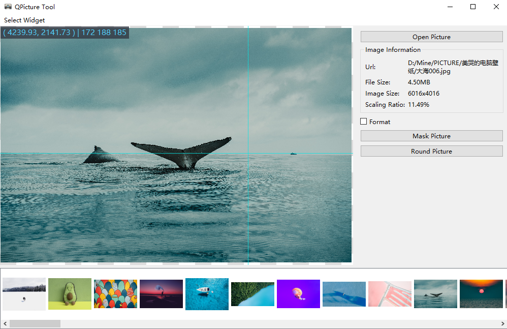
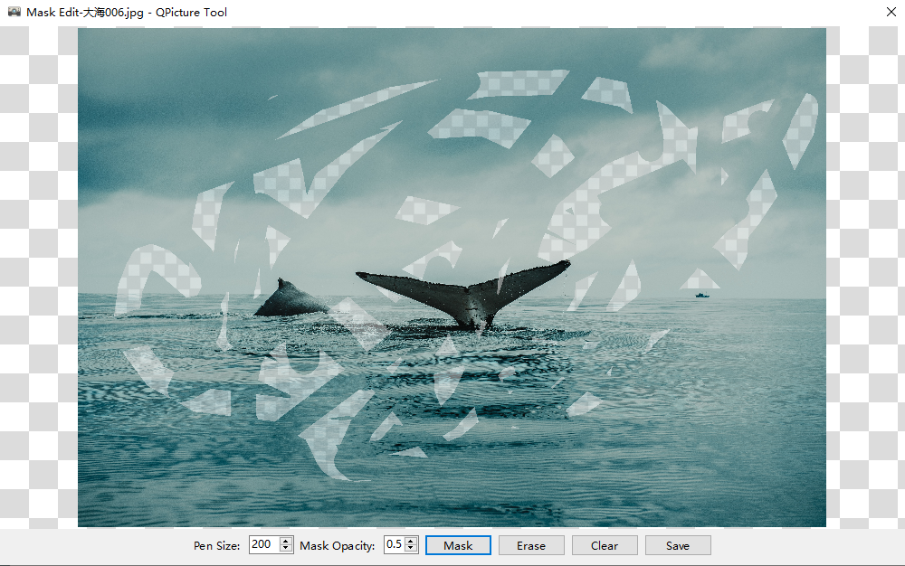
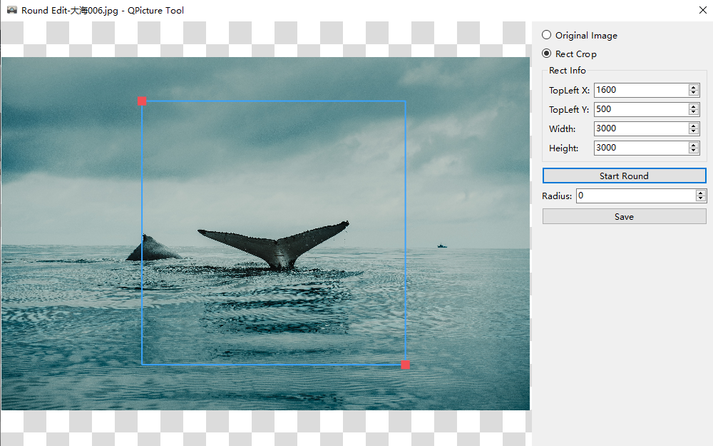
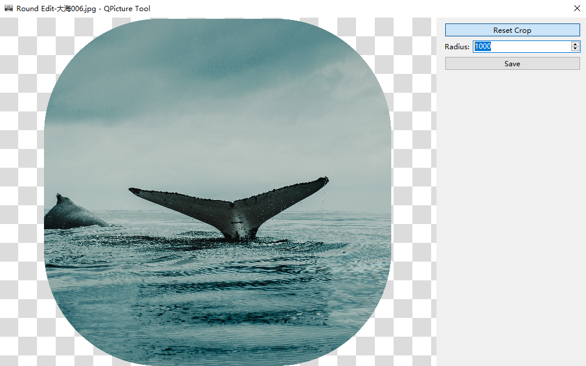
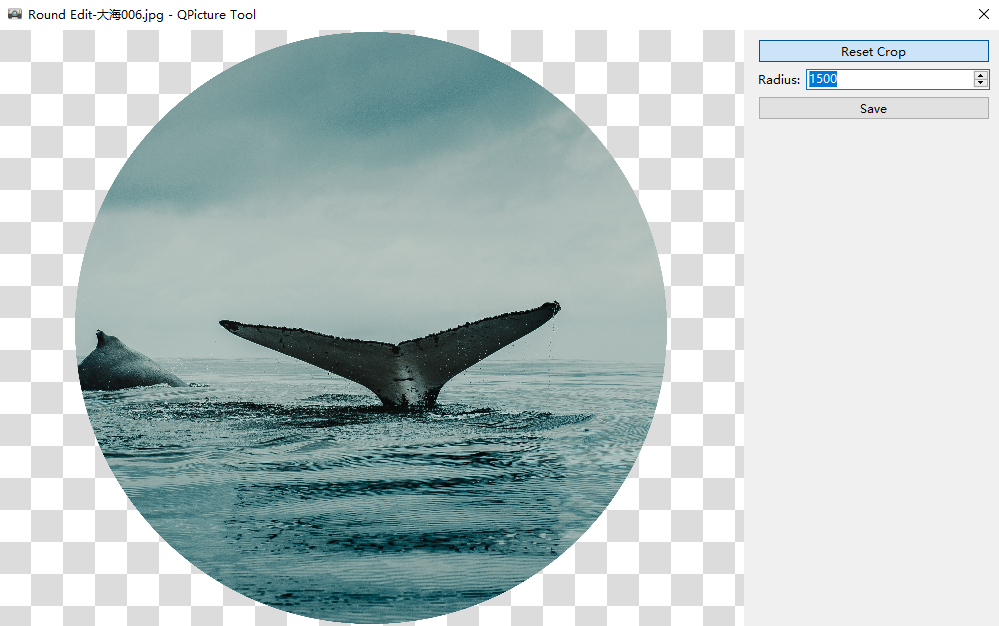
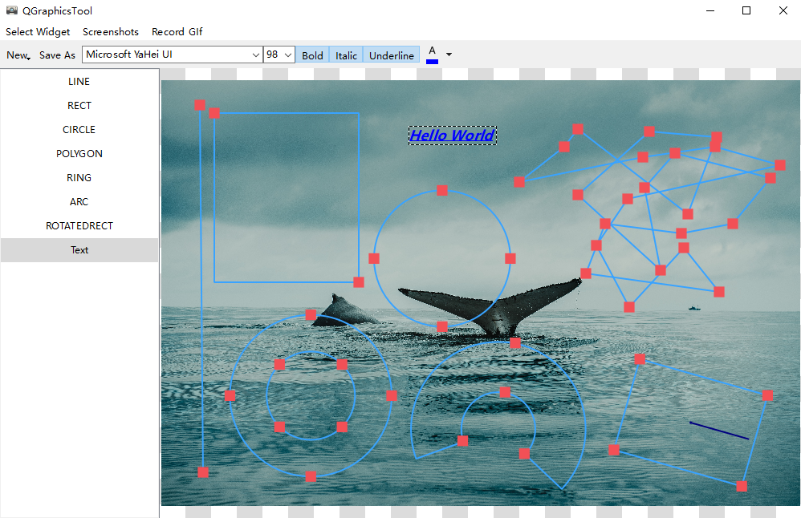
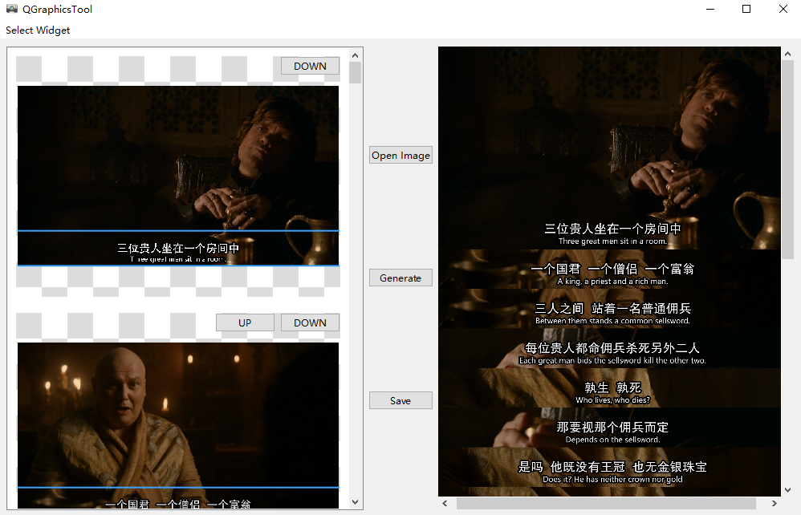
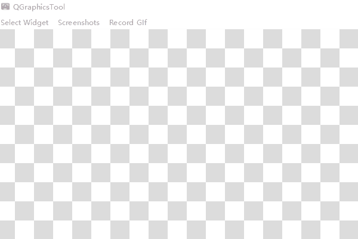

# Qt Graphics

- [简体中文](README.md)
- [English](README.en.md)

## 效果图更新会不太及时

## 看图界面：

## Opengl看图界面：

1. 性能比使用QGraphicsView的看图界面要好很多，非常流畅，占用极少的CPU资源；

### 问题

1. Opengl看图界面，在旋转任意角度的时候，纹理的宽高比会变化，导致显示不正常，这个问题还没解决；

## 马赛克绘制界面（橡皮擦效果）：

## 圆角编辑窗口（也可编辑成圆形图标）：

1. 一定要保存为PNG，不然圆角处会变成黑色；

 

 

## 简单图形绘制界面：

## 电影字幕拼接界面：

1. 左侧图片为载入后快速缩放的图片，显示不清晰，主要是为了节省占用内存；
2. 右侧图片是展示的原图，由于QImageView缩放不清晰，可以调整到原图大小查看（左侧双击），看起来就很舒服；
3. 虽然第一眼看起来模糊，但是实际生成的时候都是重新载入左侧原图剪切生成，保存后可用其他图片查看工具验证，或者按照上一点（2）查看；

## GIF录制（egif和gif-h库）和截图功能：

1. 以下为用GIF录制功能，录制截图功能使用；
2. 截屏之后可以使用（4）绘制图形；

