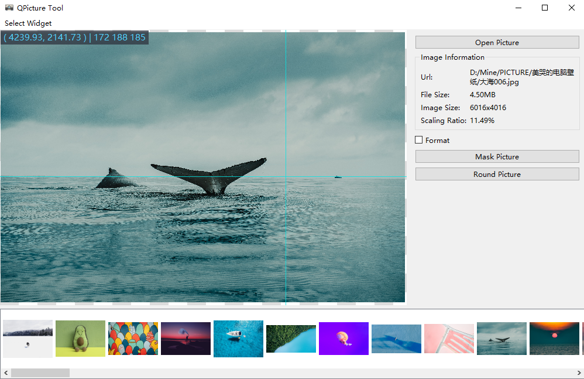
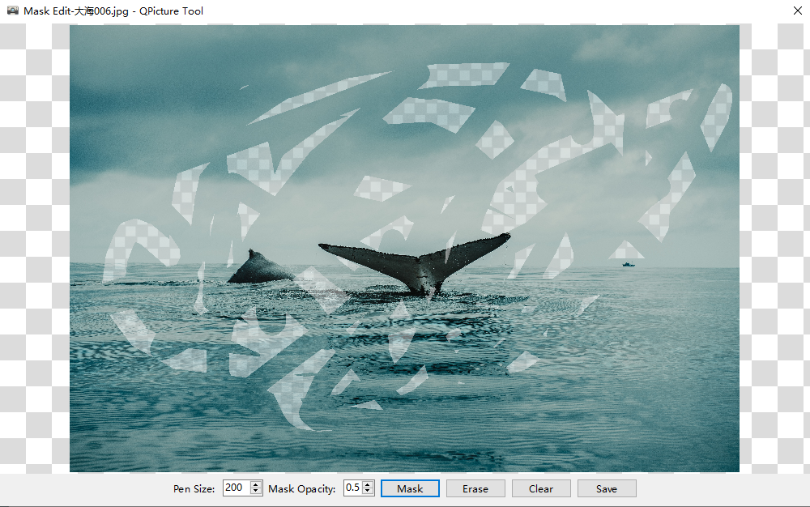
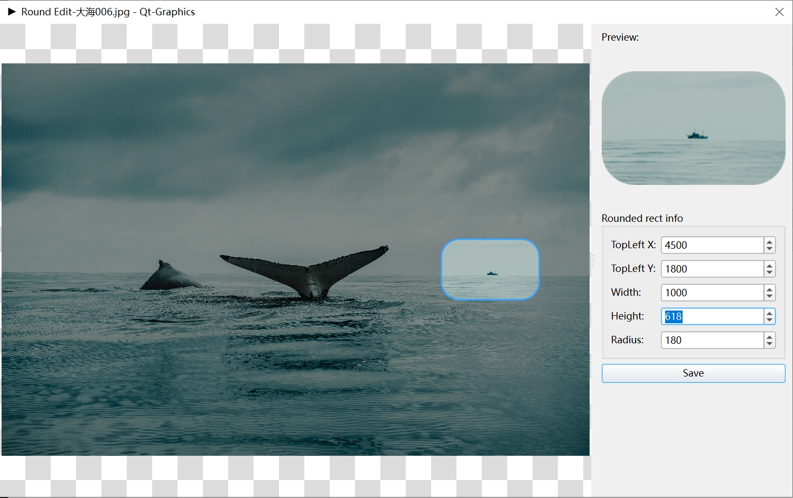
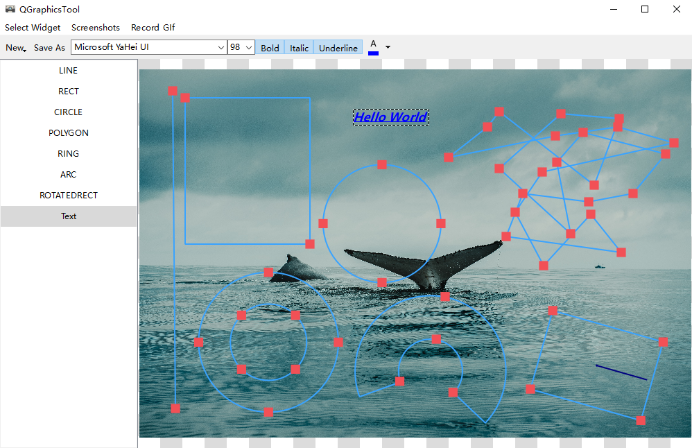
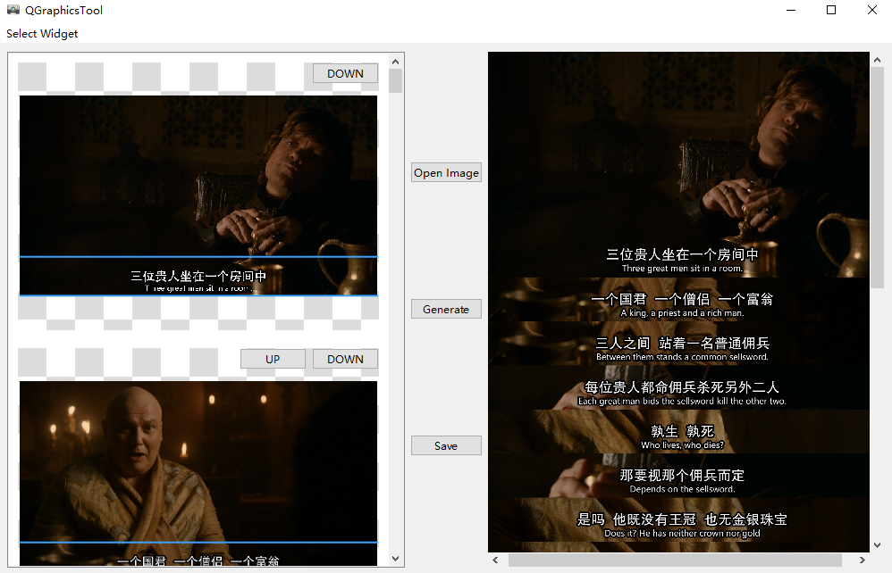
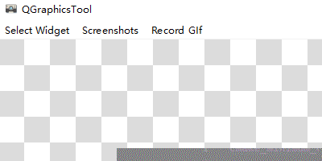

# Qt Graphics

- [简体中文](README.md)
- [English](README.en.md)

## 效果图更新会不太及时

## 支持更多图片格式，请参考[kimageformats-binaries](https://github.com/RealChuan/kimageformats-binaries/tree/dev)

1. 下载`Actions`中的`Artifacts`文件夹，把`kimg_*`的库文件解压到`Qt`打包目录下的`imageformats`文件夹中；
2. 其余部分库文件，需要放在主程序同级目录下，或者主程序可以加载到的地方。

## QRhiWidget

### 问题

#### 旋转

1. 跟OpenGL看图界面类似，在旋转任意角度的时候，纹理的宽高比会变化，导致显示不正常；

## QVulkanWindow

### 问题

#### 编译

1. [cmake](.github/workflows/cmake.yml)：在MacOS下会找不到QVulkanWindow相关的头文件，编译无法通过；
2. [qmake](.github/workflows/qmake.yml)：
    1. 在MacOS下会找不到QVulkanWindowRenderer相关的头文件，编译无法通过；
    2. 在Ubuntu下会找不到QVulkanInstance相关的头文件，编译无法通过：

#### 旋转

1. 跟OpenGL看图界面类似，在旋转任意角度的时候，纹理的宽高比会变化，导致显示不正常；

## 看图界面

## Opengl看图界面

1. 性能比使用QGraphicsView的看图界面要好很多，非常流畅，占用极少的CPU资源；

### 问题

1. Opengl看图界面，在旋转任意角度的时候，纹理的宽高比会变化，导致显示不正常，这个问题还没解决；

## 马赛克绘制界面（橡皮擦效果）

## 圆角编辑窗口（也可编辑成圆形图标）

1. 一定要保存为PNG，不然圆角处会变成黑色；

## 简单图形绘制界面

## 电影字幕拼接界面

1. 左侧图片为载入后快速缩放的图片，显示不清晰，主要是为了节省占用内存；
2. 右侧图片是展示的原图，由于QImageView缩放不清晰，可以调整到原图大小查看（左侧双击），看起来就很舒服；
3. 虽然第一眼看起来模糊，但是实际生成的时候都是重新载入左侧原图剪切生成，保存后可用其他图片查看工具验证，或者按照上一点（2）查看；

## GIF录制（egif和gif-h库）和截图功能

1. 以下为用GIF录制功能，录制截图功能使用；
2. 截屏之后可以使用（4）绘制图形；

